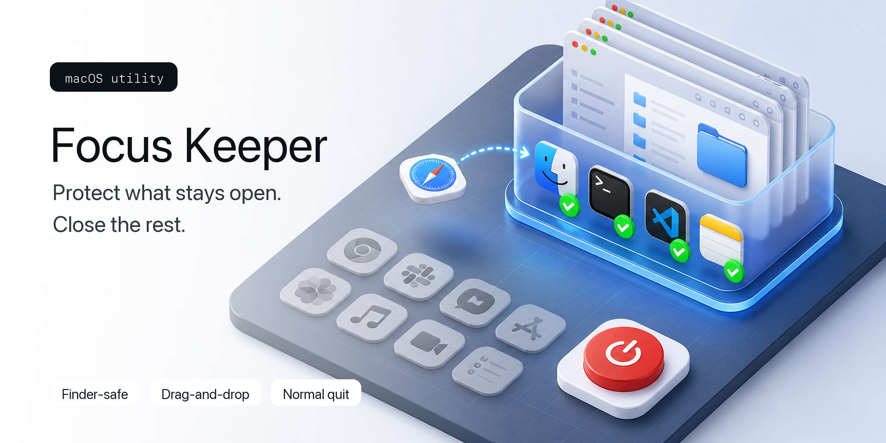

<p align="center">
  English · <a href="README_ZH.md">简体中文</a> · <a href="README_JA.md">日本語</a> · <a href="README_KO.md">한국어</a> · <a href="README_ES.md">Español</a>
</p>

<p align="center">
  
</p>

# Focus Keeper

Focus Keeper is a small native macOS utility for closing distractions while keeping the apps you choose.

Instead of editing an AppleScript whitelist, open the app, scan Applications, and protect the apps that should stay open.

## Download

Download the latest version: [`focus-keeper.dmg`](https://github.com/ai-martin-lau/focus-keeper/releases/latest/download/focus-keeper.dmg)

## How It Works

- Scans `/Applications`, `~/Applications`, and `/System/Applications`.
- Adds protected apps from the list or by dropping `.app` bundles from Finder.
- Saves the protected app list locally with `UserDefaults`.
- Closes Finder windows before quitting other apps.
- Never quits Finder itself.
- Sends normal quit requests and does not force-kill processes.

## Installation

1. Open the DMG.
2. Drag `Focus Keeper.app` into Applications.
3. Open the app and choose the apps you want to protect.

If macOS blocks the app on first launch:

1. Open System Settings.
2. Go to Privacy & Security.
3. Scroll to Security and click Open Anyway for `Focus Keeper.app`.
4. Confirm Open when macOS asks.

The first time the app closes Finder windows, macOS may ask for Automation permission. Allow it so the app can close Finder windows while keeping Finder running.

## Build From Source

```sh
./scripts/build-dmg.sh
./scripts/verify-release.sh
```

The DMG is written to `dist/focus-keeper.dmg`.
